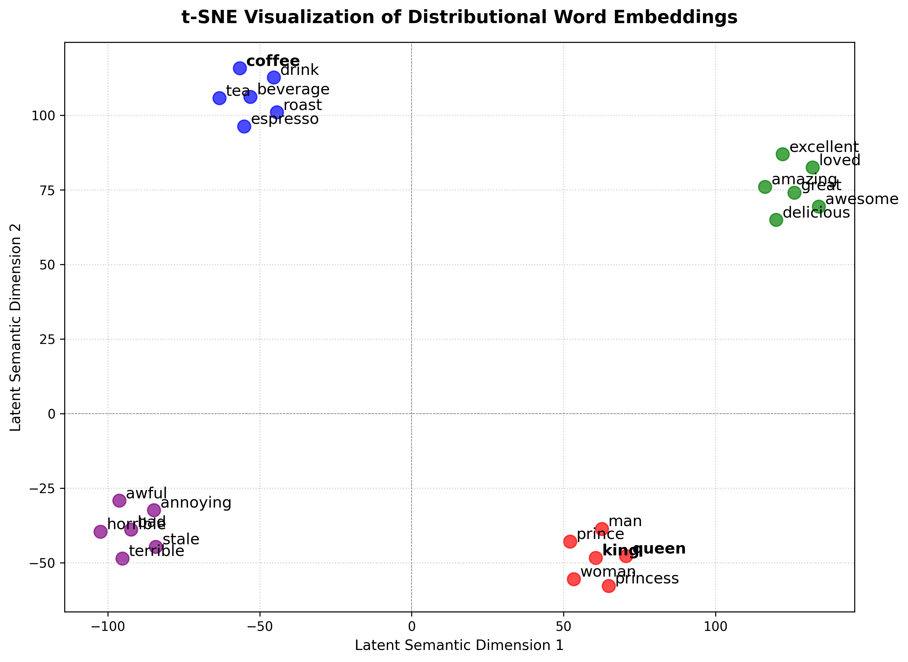

# Multi-Domain Sentiment Analysis & Length-Normalized Search Service

A production-grade, configuration-driven MLOps system that implements an offline machine learning experimentation pipeline alongside a containerized, live REST API.

This project explores the empirical contrasts between statistical feature extraction methods (**Bag-of-Words/Raw Counts** vs. **TF-IDF**) across disparate linguistic domains (**Long-form Amazon Food Reviews** vs. **Short-form Sentiment140 Tweets**), paired with a length-normalized **BM25 Search Retrieval** engine.

---

## System Architecture

The project splits workloads into two decoupled operational phases:

1. **Offline Training Pipeline (`scripts/train.py`)**: Runs a grid search across feature extractors, preprocessors, and data domains. Models and vocabularies are stored as binary artifacts and logged directly to **DagsHub (MLflow)**.
2. **Production Service Endpoint (`app/main.py`)**: A containerized FastAPI deployment that reads a centralized YAML config file to serve real-time predictions (`/predict`) and search results (`/search`) powered by `BM25Okapi`.

---

## Dataset Matrix & Core Linguistic Insights

This system evaluates model behavior on two starkly different textual domains to explore how token weightings alter classification accuracy:

### 1. Sentiment140 (Twitter Micro-text)

* **Characteristics**: Capped character lengths, noisy slang, high emoji density.
* **Empirical Finding**: `bow` (Raw Counts) and `tfidf` perform nearly identically (~73.2% vs. 73.4%). Because meaningful words rarely repeat inside a short tweet, the Term Frequency ($TF$) matrix collapses to a flat binary vector ($1$ or $0$), erasing TF-IDF's mathematical advantage.

### 2. Amazon Fine Foods (Long-form Product Reviews)

* **Characteristics**: Long-form paragraph structures, expressive language, high structural word repetition.
* **Empirical Finding**: **Raw Counts (`bow`) outperforms TF-IDF (91.1% vs. 89.5%)**. Passionate buyers use repetitive emotional keywords (*"horrible, horrible, horrible"*). Bag-of-Words captures this raw intensity linearly, giving the Logistic Regression model massive explicit gradients. TF-IDF sub-linearly squashes and normalizes these terms over long review lengths, inadvertently diluting the emotional sentiment signal.

---

## ⚙️ Configuration Management (`config.yaml`)

The system relies on a centralized config to control parameters dynamically without modifying python logic:

```yaml
mlflow:
  tracking_username: "haniaruby"
  tracking_uri: "https://dagshub.com/haniaruby/nlp-intelligence-system.mlflow"
  experiment_name: "nlp-contrastive-analysis"

data:
  amazon:
    path: "data/raw/amazon-fine-foods/Reviews.csv"
  sentiment140:
    path: "data/raw/sentiment/training.1600000.processed.noemoticon.csv"
  sample_size: 20000
  test_size: 0.2
  random_state: 42

features:
  max_features: 5000

model:
  max_iter: 1000

search:
  top_k: 2

```

---

## Reproducibility and MLOps Setup

### 1. Data Version Control (DVC)

Data and models are completely separated from Git tracking to avoid repository bloat.

To pull the dataset and model weights locally:

```bash
dvc pull

```

To add and push updated artifacts to remote storage:

```bash
dvc add data/raw/amazon-fine-foods/Reviews.csv
dvc add models/
dvc push

```

### 2. Executing the Grid Search Experiment Loop

To trigger all 8 experiments across datasets, tokenizers, and text normalizers (Stemming vs. Lemmatization):

```bash
python -m scripts.train

```

All metrics, parameters, and structural artifacts will automatically pipe to the integrated DagsHub MLflow UI dashboard.

---

## Production Deployment (Docker)

The API service runs within an isolated Docker layer using modern FastAPI lifespan managers to guarantee zero-downtime startup parameter resolution.

### Build and Run the Container

```bash
docker rm -f nlp_service || true

docker build -t nlp-mlops-service:latest .

docker run -d -p 8000:8000 --name nlp_service nlp-mlops-service:latest

```

### Direct Terminal Verification

Test the containerized classifier service instantly from your terminal:

```bash
curl -X 'POST' \
  'http://localhost:8000/predict' \
  -H 'Content-Type: application/json' \
  -d '{"text": "Using config files makes this pipeline so clean!", "domain": "amazon"}'

```

---

## 🔍 The Search Retrieval Layer: BM25 vs. TF-IDF

While TF-IDF vectors are generated to build static classifier boundaries, the `/search` retrieval loop uses **BM25 (Best Matching 25)**.

### Why BM25 Outperforms Counts/TF-IDF for Search

1. **Term Frequency Saturation**: Traditional TF-IDF scales linearly. A spam document repeating the word "coffee" 50 times dominates search results. BM25 scales term frequency logarithmically, hitting a strict asymptotic ceiling—meaning keyword-stuffed spam loses its score advantage.
2. **Document Length Normalization**: BM25 actively cross-references document lengths against the average corpus length. A short, highly relevant 10-word text matching your term will correctly outrank a rambling 500-word block containing accidental query mentions.

---

## Distributional Meaning vs. Classical Vector Limitations

To empirically demonstrate the power of dense semantic vector spaces over classical sparse matrices (such as Bag-of-Words and TF-IDF), this system visualizes low-dimensional projections of words using **t-SNE (t-Distributed Stochastic Neighbor Embedding)**.

### Semantic Coordinate Mapping



The projection maps high-dimensional vectors into distinct, isolated clusters based on real-world semantic overlap:
* 🔵 **Domain Context (Top-Left):** `coffee`, `espresso`, `tea`, `roast`, and `beverage` form a tight cluster, capturing their situational distribution.
* 🟢 **Positive Sentiment (Right):** `excellent`, `amazing`, `loved`, `great`, and `delicious` share high geometric proximity.
* 🟣 **Negative Sentiment (Bottom-Left):** `horrible`, `awful`, `terrible`, `stale`, and `bad` group together natively.
* 🔴 **Relational Analogy (Bottom-Right):** Gendered roles and societal metrics (`king`, `queen`, `man`, `woman`) organize linearly.

---

###  What Classical Vectors Cannot Capture

While classical counting methods treat words as completely isolated units, modern continuous embeddings operate on the **Distributional Hypothesis**

Based on our visualization, classical vectorizers introduce three fatal architectural limits:

#### 1. Synonym Blindness (Orthogonality)
In a traditional `CountVectorizer` or `TF-IDF` model, every single unique token is given its own independent coordinate axis. 
* **The Math:** The dot product (mathematical similarity) between `coffee` and `espresso` or `terrible` and `awful` in a classical space is **exactly 0**. Therefore the model doesn't see the connection between the words.

#### 2. Geometry Failure in Conceptual Analogies
Classical vectors possess no relational alignment. They cannot process algebraic semantics. Because continuous embeddings preserve semantic shifts as physical directional vectors in space.

#### 3. Curse of Dimensionality
If a dataset features a vocabulary of 50,000 words, classical methods force every sentence to become an empty, 50,000-dimensional matrix populated almost entirely by zeros. Dense embeddings compress this meaning down into a tight, highly efficient, and continuous space (typically 100–300 dimensions) where every value represents a latent semantic signal.